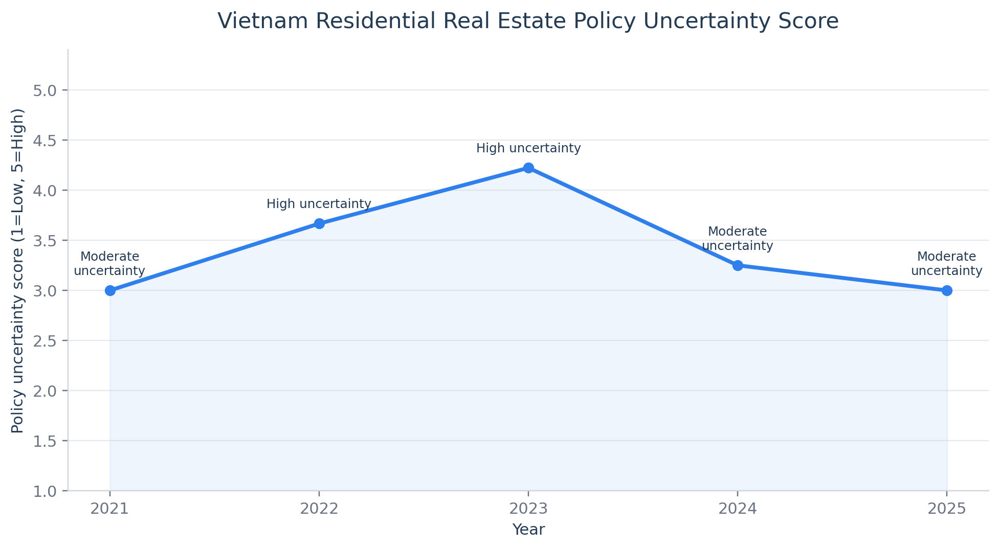
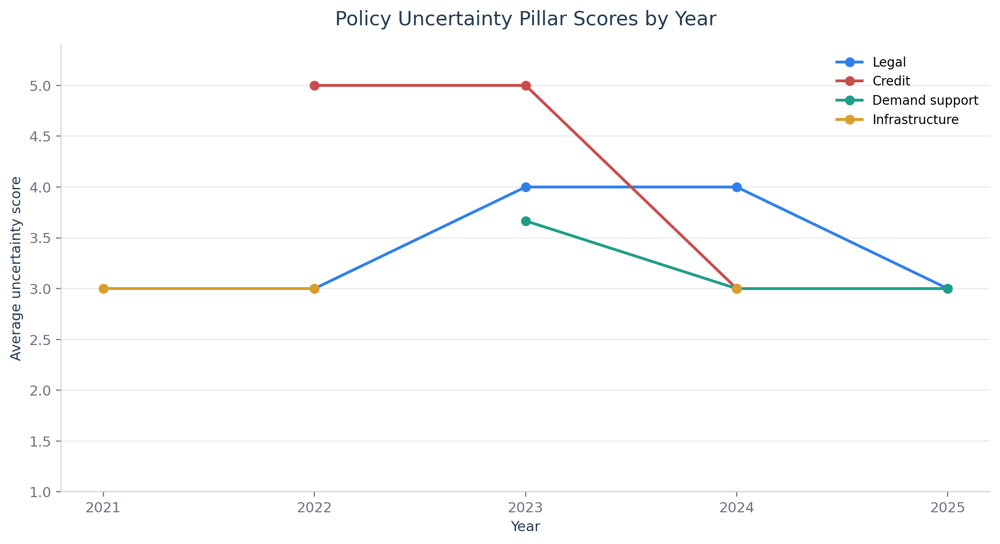
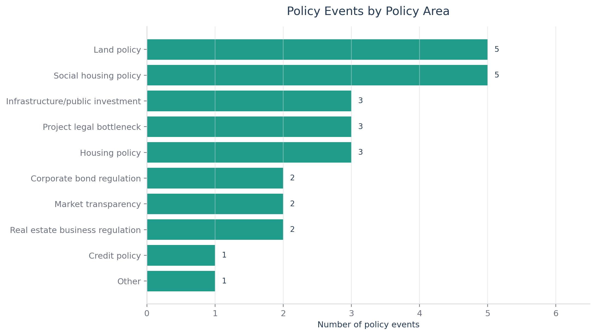
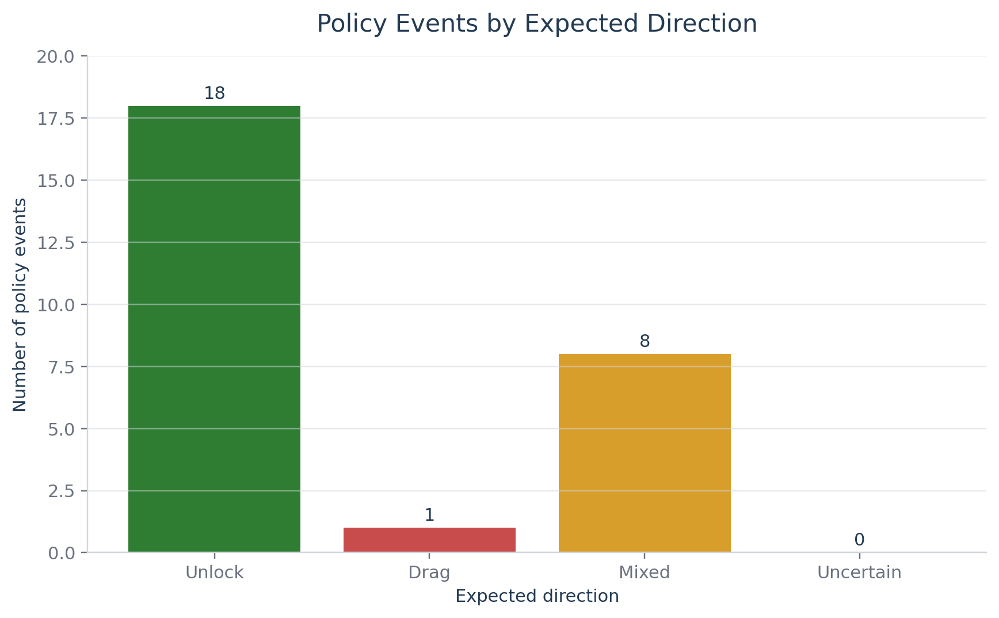
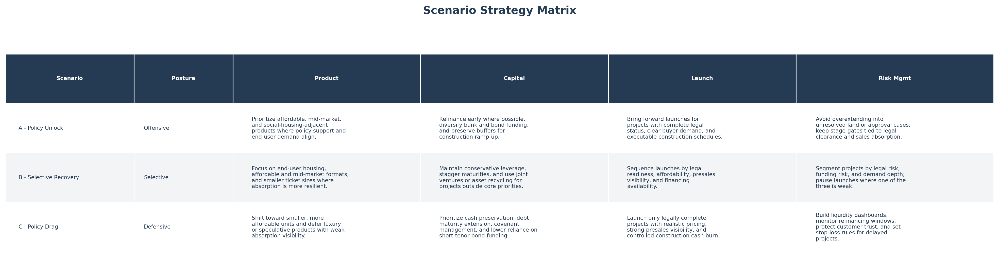
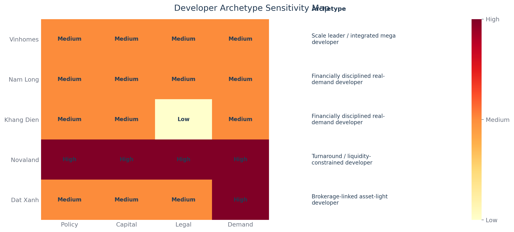
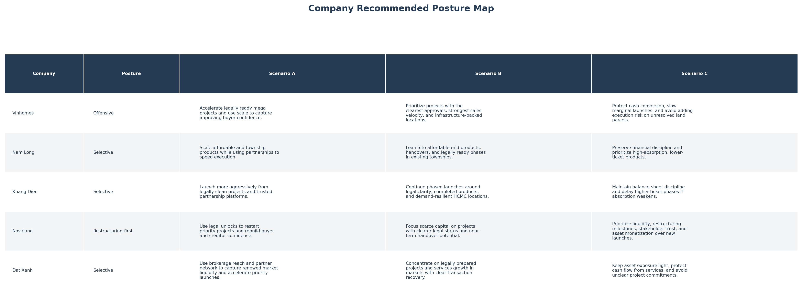

# Vietnam Residential Real Estate Strategy Under Policy Uncertainty

A consulting-style strategy case on how Vietnamese residential developers should allocate capital, phase launches, and position land banks under policy uncertainty from 2026-2030.

How public policy uncertainty shapes developer strategy, market structure, and capital allocation in Vietnam's residential real estate sector.

## Project Overview

This is a consulting-style market strategy project, not a valuation project. It analyzes how public policy uncertainty affects Vietnam residential real estate developers' product, land bank, capital, and launch strategies, then translates the findings into scenarios, developer archetypes, and strategic recommendations.

## 3-Minute Reading Guide

If you are reviewing this project quickly:

1. Start with `report/market_strategy_memo.md` for the executive recommendation.
2. Review `output/charts/05_scenario_strategy_matrix.png` for the scenario logic.
3. Review `output/charts/06_developer_archetype_map.png` for company positioning.
4. Check `data/source_log.csv` to see the official policy sources behind the analysis.

## Core Business Question

How should Vietnamese residential real estate developers adapt their product, land bank, capital, and launch strategies under public policy uncertainty during 2026-2030?

## Core Strategic Insight

The key strategic shift is not from pessimism to optimism, but from broad-market recovery thinking to policy-contingent capital allocation. Developers should not ask only "Will the market recover?" They should ask which projects become executable under each policy path, which customer segments can absorb supply, and which balance sheets can survive delayed implementation.

## Why This Project Matters

Vietnam real estate is heavily shaped by public policy. Land rules, housing regulation, credit policy, corporate bond regulation, social housing programs, infrastructure execution, and market transparency requirements can all affect supply, demand, capital access, project launches, and market structure.

This project demonstrates market structure analysis, policy analysis, scenario planning, and strategic recommendation skills. It complements an FPT valuation project by showing consulting-style strategy work rather than company valuation alone.

## Analytical Flow

```text
Policy timeline -> Policy Uncertainty Index -> Scenario Matrix -> Developer Archetypes -> Strategic Memo
```

## Key Outputs

- `data/policy_timeline.csv`
- `output/policy_uncertainty_index.csv`
- `output/scenario_matrix.csv`
- `data/developer_strategy_cases.csv`
- `output/developer_archetypes.csv`
- `output/charts/`
- `report/market_strategy_memo.md`

## Key Findings

- 27 policy events were coded from the 2021-2025 policy cycle.
- 2023 had the highest uncertainty score at 4.22.
- Credit uncertainty was the dominant driver in 2022-2023.
- Legal uncertainty became the dominant driver in 2024.
- 2025 showed a tie between legal and demand-support uncertainty.
- Developers should not bet on one policy forecast; they should build policy-resilient strategies.

## Scenario Summary

| Scenario | Strategic posture | Implication |
|---|---|---|
| Scenario A - Policy Unlock | Offensive | Accelerate legally clean projects and selective growth |
| Scenario B - Selective Recovery | Selective | Prioritize real-demand segments, phased launches, and liquidity discipline |
| Scenario C - Policy Drag | Defensive | Preserve cash, restructure capital, delay unclear projects |

## Developer Archetypes

| Company | Archetype | Recommended posture |
|---|---|---|
| Vinhomes | Scale leader / integrated mega developer | Offensive |
| Nam Long | Financially disciplined real-demand developer | Selective |
| Khang Dien | Financially disciplined real-demand developer | Selective |
| Novaland | Turnaround / liquidity-constrained developer | Restructuring-first |
| Dat Xanh | Brokerage-linked asset-light developer | Selective |

## Visual Preview

### Annual Policy Uncertainty Score



### Policy Uncertainty Pillar Scores



### Policy Events by Area



### Policy Direction Mix



### Scenario Strategy Matrix



### Developer Archetype Map



### Company Recommended Posture Map



## Repository Structure

```text
02_vietnam_real_estate_policy_strategy/
├── README.md
├── PROJECT_BRIEF.md
├── LINKEDIN_POST.md
├── requirements.txt
├── data/
│   ├── raw/
│   ├── processed/
│   ├── policy_timeline.csv
│   ├── policy_timeline_template.csv
│   ├── developer_strategy_cases.csv
│   ├── developer_strategy_cases_template.csv
│   ├── market_indicators_template.csv
│   ├── source_collection_plan.md
│   ├── source_log.csv
│   └── source_log_template.csv
├── notebooks/
│   ├── policy_uncertainty_index.py
│   ├── scenario_analysis.py
│   ├── market_structure_analysis.py
│   └── create_charts.py
├── output/
│   ├── policy_uncertainty_index.csv
│   ├── scenario_matrix.csv
│   ├── developer_archetypes.csv
│   └── charts/
│       ├── 01_policy_uncertainty_score.png
│       ├── 02_uncertainty_pillars_by_year.png
│       ├── 03_policy_events_by_area.png
│       ├── 04_policy_direction_mix.png
│       ├── 05_scenario_strategy_matrix.png
│       ├── 06_developer_archetype_map.png
│       └── 07_company_posture_map.png
└── report/
    ├── market_strategy_memo.md
    └── market_strategy_memo_template.md
```

## How To Run

Run the workflow from the project root.

Optional Windows virtual environment setup:

```bash
python -m venv .venv
.venv\Scripts\activate
pip install -r requirements.txt
```

Install dependencies and run the analysis scripts:

```bash
pip install -r requirements.txt

python notebooks/policy_uncertainty_index.py
python notebooks/scenario_analysis.py
python notebooks/market_structure_analysis.py
python notebooks/create_charts.py
```

## Methodology

Policy events were coded into categories such as land policy, housing policy, credit policy, corporate bond regulation, social housing policy, infrastructure/public investment, project legal bottlenecks, and market transparency.

Uncertainty levels were mapped into simple numeric scores: Low = 1, Medium = 3, and High = 5. Annual pillar scores were calculated across legal uncertainty, credit uncertainty, demand-support uncertainty, and infrastructure-execution uncertainty. Scenarios were built as planning tools, not forecasts. Developer archetypes were classified from public information captured in the project case files.

| Uncertainty level | Score | Coding logic |
|---|---:|---|
| Low | 1 | Rule direction and implementation path are relatively clear. |
| Medium | 3 | Policy direction is clear, but timing, local execution, or eligibility varies. |
| High | 5 | Policy impact is material, but implementation, eligibility, market response, or developer-specific effects remain uncertain. |

The scoring is designed for transparent scenario planning, not statistical inference.

## Limitations

- The Policy Uncertainty Index is rule-based, not an official index.
- The project uses public sources only.
- Scenario planning is not prediction.
- Company classifications depend on available disclosures.
- This is not a valuation or investment recommendation.

## Portfolio Relevance

This project demonstrates:

- Market structure analysis
- Public policy analysis
- Strategic scenario planning
- Company archetype classification
- Python-based analytical workflow
- Consulting-style communication
